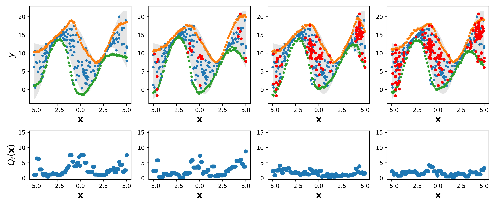

[//]: # ([![arXiv]&#40;https://img.shields.io/badge/arXiv-2212.06370-b31b1b.svg&#41;]&#40;https://arxiv.org/abs/2212.06370&#41;)

[//]: # ([![Open In Colab]&#40;https://colab.research.google.com/assets/colab-badge.svg&#41;]&#40;https://colab.research.google.com/github/NISL-MSU/PredictionIntervals/blob/master/DualAQD_PredictionIntervals.ipynb&#41;)

# ASPINN: Adaptive Sampling with Prediction-Interval Neural Networks

## Description

This paper presents an adaptive sampling approach designed to reduce epistemic uncertainty in predictive models. 
Our primary contribution is the development of a metric that estimates potential epistemic uncertainty leveraging prediction interval-generation neural
networks.
This estimation relies on the distance between the predicted upper and lower bounds and the observed data at the tested positions and their neighboring points. 
Our second contribution is the proposal of a batch sampling strategy based on Gaussian processes (GPs). 
A GP is used as a surrogate model of the networks trained at each iteration of the adaptive sampling process. 
Using this GP, we design an acquisition function that selects a combination of sampling locations to maximize the reduction of epistemic uncertainty across the domain.

<div style="display: flex; justify-content: center;">
  <figure style="text-align: center;">
    
    <figcaption>Example of the adaptive sampling process using ASPINN.</figcaption>
  </figure>
</div>

## Usage

The following libraries have to be installed:
* [Pytorch](https://pytorch.org/)
* [PredictionIntervals](https://github.com/NISL-MSU/PredictionIntervals): To install this package, run `!pip install -q git+https://github.com/NISL-MSU/PredictionIntervals` in the terminal. 


### Reproduce Paper Results

Let's begin with the 1-D problems. We create an instance of the class `Sampler` and call its `run()` method.

**Parameters**:

*   `dataset`: Name of the dataset. Options: ['cos', 'hetero', 'cosexp'] (**Note**: 'cosexp' is called 'cosqr' in the paper)
*   `method:` Name of the uncertainty model method. Options: ['ASPINN', 'MCDropout', 'GP'].
*   `n_extra_samples`: Numer of additional data points that are sampled at each iteration
*   `n_iterations`: Total number of iterations
*   `multiple_seeds`: If True, repeat the experiments 10 times using multiple seeds
*   `evaluate`: If True, train a separate PI-generation NN that will calculate performance metrics

**Note**: In this repository, we implemented the following methods: ASPINN, MCDropout, and standard GP. 
The NF-Ensemble method was executed using its own [repository](https://github.com/nwaftp23/nflows_epistemic) with the same data partitions and seeds.

```python
from AdaptiveSampling.Sampler_Known_Datasets import SamplerKD
# Input arguments
dataset = 'cos'
n_extra_samples = 5
n_iterations = 50
multiple_seeds = True
evaluate = False
method = 'ASPINN'
# Hyperparameters
if method == 'ASPINN':
    hyperparameters = {'epsi': 0.25, 'length': 60}
else:
    hyperparameters = {}

sampler = SamplerKD(dataset=dataset,
                    method=method,
                    n_extra_samples=n_extra_samples,
                    n_iterations=n_iterations,
                    multiple_seeds=multiple_seeds,
                    evaluate=evaluate)
sampler.run(**hyperparameters)
```

For the multi-dimensional problem that simulates a real-world agricultural field site, we execute the following:

```python
from AdaptiveSampling.Sampler_MZ import SamplerMZ
# Input arguments
n_extra_samples = 1
n_iterations = 50
multiple_seeds = True
evaluate = False
method = 'ASPINN'
if method == 'ASPINN':
    hyperparameters = {'epsi': 0.25, 'length': 0.1}
else:
    hyperparameters = {}

sampler = SamplerMZ(method=method,
                    n_extra_samples=n_extra_samples,
                    n_iterations=n_iterations,
                    multiple_seeds=multiple_seeds,
                    evaluate=evaluate)
sampler.run(**hyperparameters)
```

### Use your own data

In general, given a dataset `(X: np.array, Y: np.array)` whose underlying function is unknown and the objective is 
to obtain a recommendation of `n_extra_samples` sampling positions, we use the class `Sampler`.

**Parameters**:

*   `data`: Tuple containing dataset of the type (np.array(X), np.array(Y))
*   `grid`: Define the input domain and all possible values that the variables can take. E.g., np.linspace(-5, -5, 100)
*   `n_extra_samples`: Numer of additional data points that are sampled at each iteration
*   `method:` Name of the uncertainty model method. Options: ['ASPINN', 'MCDropout', 'GP'].
*   `problem`: Name of the problem/dataset. If not provided, results are saved in results/Test

```python
from AdaptiveSampling.Sampler import Sampler
sampler = Sampler(data=(X, Y),
                  grid=np.linspace(-5, -5, 100),
                  n_extra_samples=10,
                  method='ASPINN')
sampler.run()
```


# Citation
Use this Bibtex to cite this repository

```
@article{ASPINN 
title={Adaptive Sampling to Reduce Epistemic Uncertainty Using Prediction Interval-Generation Neural Networks},
author={Morales, Giorgio and Sheppard, John}, 
volume={}, 
number={}, 
journal={Proceedings of the AAAI Conference on Artificial Intelligence}, 
year={2025}, 
month={Feb.}, 
pages={} 
}
```